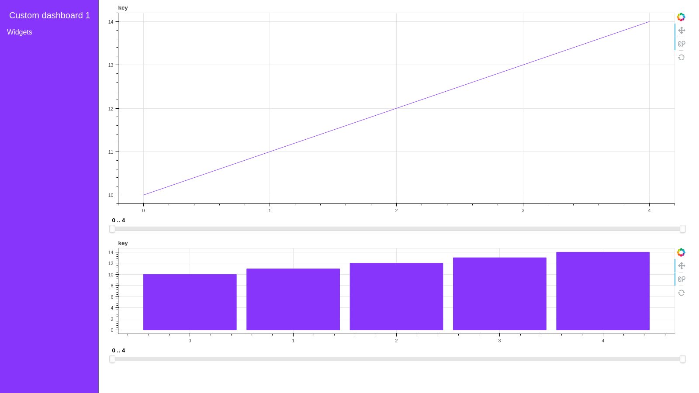

# <div align="left">&nbsp; cuXfilter

cuXfilter ( ku-cross-filter ) is a [RAPIDS](https://github.com/rapidsai) framework to connect web visualizations to GPU accelerated crossfiltering. Inspired by the javascript version of the [original]( https://github.com/crossfilter/crossfilter), it enables interactive and super fast multi-dimensional filtering of 100 million+ row tabular datasets via [cuDF](https://github.com/rapidsai/cudf). 

## RAPIDS Viz
cuXfilter is one of the core projects of the “RAPIDS viz” team. Taking the axiom that “a slider is worth a thousand queries” from @lmeyerov to heart, we want to enable fast exploratory data analytics through an easier-to-use pythonic notebook interface. 

As there are many fantastic visualization libraries available for the web, our general principle is not to create our own viz library, but to enhance others with faster acceleration, larger datasets, and better dev UX. **Basically, we want to take the headache out of interconnecting multiple charts to a GPU backend, so you can get to visually exploring data faster.**

By the way, cuXfilter is best used to interact with large (1 million+) tabular datasets. GPU’s are fast, but accessing that speedup requires some architecture overhead that isn’t worthwhile for small datasets. 

For more detailed requirements, see below.

## cuXfilter.py Architecture

The python version of cuXfilter leverage jupyter notebook and bokeh server to greatly reduce backend complexity. Currently we are focusing development efforts on the python version instead of the older javascript version.


### What is cuDataTiles?

cuXfilter.py implements cuDataTiles, a GPU accelerated version of data tiles based on the work of [Falcon](https://github.com/uwdata/falcon). When starting to interact with specific charts in a cuXfilter dashboard, values for the other charts are precomputed to allow for fast slider scrubbing without having to recalculate values. 

### Open Source Projects

cuXfilter wouldn’t be possible without using these great open source projects:

- [Bokeh](https://bokeh.pydata.org/en/latest/)
- [DataShader](http://datashader.org/)
- [Panel](https://panel.pyviz.org/)
- [Falcon](https://github.com/uwdata/falcon)
- [Jupyter](https://jupyter.org/about)


### Where is the original cuXfilter and Mortgage Viz Demo?

The original version (0.1) of cuXfilter, most known for the backend powering the Mortgage Viz Demo, has been moved into the `/javascript` folder. As it has a much more complicated backend and javascript API, we’ve decided to focus more on the streamlined notebook focused version in the `/python` folder.

## Get Started

```python
import cuXfilter
from cuXfilter import charts
from cuXfilter.layouts import feature_and_base

#update data_dir if you have downloaded datasets elsewhere
DATA_DIR = './data'
from cuXfilter.sampledata import datasets_check
datasets_check('auto_accidents', base_dir=DATA_DIR)

cux_df = cuXfilter.DataFrame.from_arrow('./data/auto_accidents.arrow')
cux_df.data['ST_CASE'] = cux_df.data['ST_CASE'].astype('float64')

label_map = {1: 'Sunday',    2: 'Monday',    3: 'Tuesday',    4: 'Wednesday',   5: 'Thursday',    6: 'Friday',    7: 'Saturday',    9: 'Unknown'}

gtc_demo_red_blue_palette = [ (49,130,189), (107,174,214), (123, 142, 216), (226,103,152), (255,0,104) , (50,50,50) ]

from bokeh.tile_providers import get_provider as gp
tile_provider = gp('CARTODBPOSITRON')

#declare charts
chart1 = charts.cudatashader.scatter_geo(x='dropoff_x', y='dropoff_y', aggregate_col='ST_CASE',
                                        tile_provider=tile_provider,
                                         color_palette=gtc_demo_red_blue_palette,)

chart2 = charts.panel_widgets.multi_select('YEAR')

chart3 = charts.bokeh.bar('DAY_WEEK', x_label_map=label_map)

#declare dashboard
d = cux_df.dashboard([chart1, chart3, chart2], layout=cuXfilter.layouts.feature_and_base,theme = cuXfilter.themes.rapids, title='Auto Accident Dataset')

#display the dashboard as a web-app(interactive)
d.show()

#view the interactive dashboard(without layouts) inside the notebook
d.app()

#preview the dashboard inside the notebook(non-interactive) with layout
await d.preview()
```


## Documentation

Full documentation can be found [here](https://rapidsai.github.io/cuxfilter/index.html).

Troubleshooting help can be found [here](https://rapidsai.github.io/cuxfilter/installation.html#troubleshooting).

## Dependecies

- [cudf](https://github.com/rapidsai/cudf)
- [panel](https://github.com/pyviz/panel)
- [bokeh](https://github.com/bokeh/bokeh)
- [cuDatashader](https://github.com/rapidsai/cudatashader)

## Installation

> You need to have RAPIDS (cudf) installed for cuXfilter to work


### 1. If installing within the rapidai DOCKER container, follow the following instructions

```bash

Before you start juypter lab, you need to install cuxfilter and cudatashader.  In terminal, when you start docker, please run the following commands:

#Get to the /rapidsai folder, up one level, where the libraries live.  List files to verify (you'll see cuspatal, cuml, cdf, etc)
cd /rapids

#Clone cuxfilter here
git clone https://github.com/rapidsai/cuxfilter

#Drop into cuxfilter's python library folder, make, and install
cd cuxfilter/python
/opt/conda/envs/rapids/bin/python -m pip install -U -r requirements.txt
/opt/conda/envs/rapids/bin/python -m pip install -e .

#Get back to /rapidsai folder
cd /rapids

#clone cudatashader
git clone https://github.com/rapidsai/cudatashader

#Drop into cudatashader folder and install
cd cudatashader
/opt/conda/envs/rapids/bin/python -m pip install -e .

# start a jupyter lab environment
# visit localhost:8888/
```

To run the bokeh server in a jupyter lab

1. expose an additional port for server, lets call it bokeh_port.
2. Install jupyterlab dependencies

```bash
conda install -c conda-forge jupyterlab
jupyter labextension install @pyviz/jupyterlab_pyviz
jupyter labextension install jupyterlab_bokeh
```

3.running the server
```bash
#enter ip address without http://
#current port is the port at which jupyterlab is running
d.app(url='ip.addr:current_port', port=bokeh_port)
# OR for a separate web app
d.show('ip.addr:bokeh_port')

```


### 2. If installing in a conda environment


```bash

#Clone cuxfilter here
git clone https://github.com/rapidsai/cuxfilter

#create a conda environment
conda create -n test_env
source activate test_env


#Drop into cuxfilter's python library folder, make, and install
cd cuxfilter/python
make
pip install -e .

#Get back to /rapidsai folder
cd ..
cd ..

#clone cudatashader
git clone https://github.com/rapidsai/cudatashader

Drop into cudatashader folder and install
cd cudatashader
pip install -e .

```

## Download Datasets

1. Auto download datasets

The notebooks inside `python/notebooks` already have a check function which verifies whether the example dataset is downloaded, and downloads it if it's not.

2. Download manually

While in the directory you want the datasets to be saved, execute the following

```bash
#go the the environment where cuXfilter is installed. Skip if in a docker container
source activate test_env

#download and extract the datasets
python -c "from cuXfilter.sampledata import datasets_check; datasets_check(base_dir='./')"
```

Individual links:

- Download the mortgage dataset from [here](https://docs.rapids.ai/datasets/mortgage-viz-data)

- Nyc taxi dataset from [here](https://s3.amazonaws.com/nyc-tlc/trip+data/yellow_tripdata_2015-01.csv)

- Auto dataset from [here](https://s3.us-east-2.amazonaws.com/rapidsai-data/viz-data/auto_accidents.arrow.gz)


## Guides and Layout Templates

Currently supported layout templates and example code can be found [here](https://rapidsai.github.io/cuxfilter/layouts/Layouts.html)

### Currently Supported Charts
| Library  | Chart type |
| ------------- | ------------- |
| bokeh  | bar, line, choropleth  |
| cudatashader  | scatter, scatter_geo, line, stacked_lines, heatmap |
| panel_widgets  | range_slider, float_slider, int_slider, drop_down, multi_select  |
| custom    | view_dataframe |

Our plan is to **add support in the future** for the following libraries:
1. plotly
2. altair
3. pydeck

## Contributing Developers Guide

cuXfilter.py acts like a connector library and it is easy to add support for new libraries. The `python/cuxfilter/charts/core` directory has all the core chart classes which can be inherited and used to implement a few (viz related) functions and support dashboarding in cuXfilter directly.

You can see the examples to implement viz libraries in the bokeh and cudatashader directories. Let us know if you would like to add a chart by opening a feature request issue or submitting a PR.

For more details, check out the [contributing guide](./CONTRIBUTING.md).

## Future Work
cuXfilter development is in early stages and on going. See what we are planning next on the [projects page](https://github.com/rapidsai/cuxfilter/projects).

