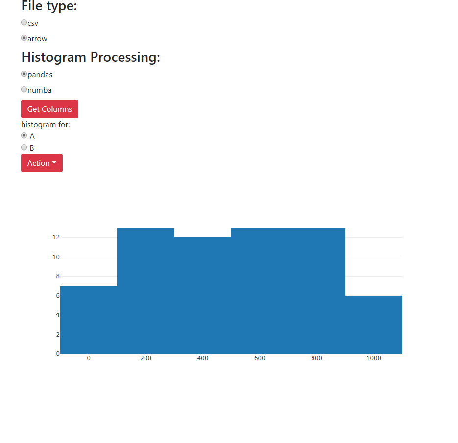

## AIM: 

CPU Baseline: Webserver loads data, receive & performs a filtering & histogramming command, and sends resulting histograms back. The baseline can use Python's Pandas library because it is one of the most common CPU dataframe libraries, and call the Python services from a NodeJS webapp to mirror a common web architecture. The result will be visualized with a simple interactive webpage, e.g., histograms with some filter buttons.

1. Node-server: allows uploading files, calling the python scripts in background, and rendering the histogram on http://localhost:3000/calc. Upload on http://localhost:3000/upload

2. python-scripts: Includes scripts to generate random data: python .\generate-random-dataset.py 1000000 -> generates a two columns 1M row data set and stores it as a csv file.
Also includes scripts that uses pandas functions on the user uploaded data, and returns histograms

Sample UI:

Profiling:

https://docs.google.com/spreadsheets/d/1jFcFx_DzgHRF_NucQKYLr7o-vU4heBfQREwM8H0GKsM/edit?usp=sharing

Branch -> socket-version: persistent connection between node and python process to avoid unnecessary loading of arrow file every time a request is made.

To build using Docker:

while in the directory, run the following commands:
(you should already have pygdf image in your local system)

- sudo docker build -t athorve/viz .
- sudo docker run --runtime=nvidia -it -p 3000:3000 athorve/viz bash

root@<image-code>: source activate gdf
root@<image-code>: npm start