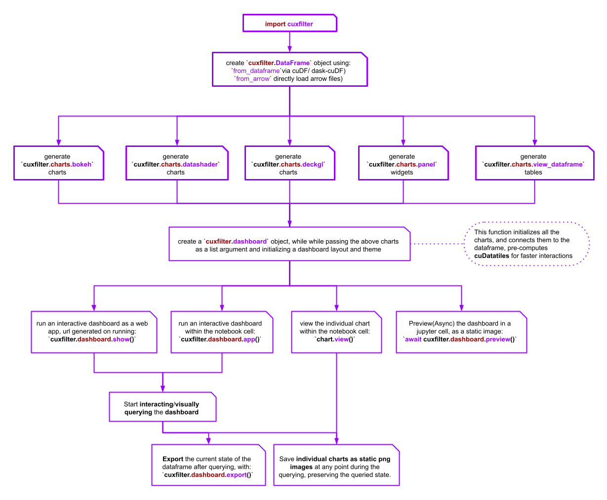
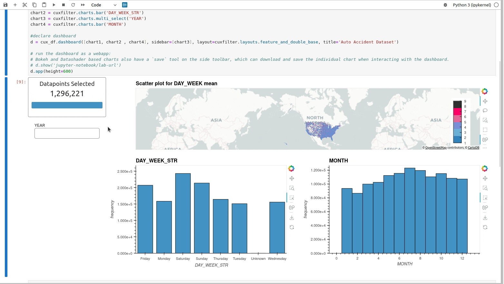

# <div align="left">&nbsp; cuxfilter

[](https://gpuci.gpuopenanalytics.com/job/rapidsai/job/gpuci/job/cuxfilter/job/branches/job/cuxfilter-branch-pipeline/)

cuxfilter ( ku-cross-filter ) is a [RAPIDS](https://github.com/rapidsai) framework to connect web visualizations to GPU accelerated crossfiltering. Inspired by the javascript version of the [original]( https://github.com/crossfilter/crossfilter), it enables interactive and super fast multi-dimensional filtering of 100 million+ row tabular datasets via [cuDF](https://github.com/rapidsai/cudf).

## RAPIDS Viz

cuxfilter is one of the core projects of the “RAPIDS viz” team. Taking the axiom that “a slider is worth a thousand queries” from @lmeyerov to heart, we want to enable fast exploratory data analytics through an easier-to-use pythonic notebook interface.

As there are many fantastic visualization libraries available for the web, our general principle is not to create our own viz library, but to enhance others with faster acceleration, larger datasets, and better dev UX. **Basically, we want to take the headache out of interconnecting multiple charts to a GPU backend, so you can get to visually exploring data faster.**

By the way, cuxfilter is best used to interact with large (1 million+) tabular datasets. GPU’s are fast, but accessing that speedup requires some architecture overhead that isn’t worthwhile for small datasets.

For more detailed requirements, see below.

## cuxfilter Architecture

The current version of cuxfilter leverages jupyter notebook and bokeh server to reduce architecture and installation complexity.



### What is cuDataTiles?

cuxfilter implements cuDataTiles, a GPU accelerated version of data tiles based on the work of [Falcon](https://github.com/uwdata/falcon). When starting to interact with specific charts in a cuxfilter dashboard, values for the other charts are precomputed to allow for fast slider scrubbing without having to recalculate values.

### Open Source Projects

cuxfilter wouldn’t be possible without using these great open source projects:

- [Bokeh](https://docs.bokeh.org/en/latest/)
- [DataShader](http://datashader.org/)
- [Panel](https://panel.pyviz.org/)
- [Falcon](https://github.com/uwdata/falcon)
- [Jupyter](https://jupyter.org/about)

### Where is the original cuxfilter and Mortgage Viz Demo?

The original version (0.2) of cuxfilter, most known for the backend powering the Mortgage Viz Demo, has been moved into the [`GTC-2018-mortgage-visualization branch`](https://github.com/rapidsai/cuxfilter/tree/GTC-2018-mortgage-visualization) branch. As it has a much more complicated backend and javascript API, we’ve decided to focus more on the streamlined notebook focused version here.

## Usage

### Example 1

[](https://studiolab.sagemaker.aws/import/github/rapidsai/cuxfilter/blob/branch-22.02/notebooks/auto_accidents_example.ipynb) [](./notebooks/README.md#amazon-sagemaker-studio-lab)

[](https://colab.research.google.com/github/rapidsai/cuxfilter/blob/branch-22.02/notebooks/auto_accidents_example.ipynb) [](./notebooks/README.md#google-colab)

```python
import cuxfilter

#update data_dir if you have downloaded datasets elsewhere
DATA_DIR = './data'
from cuxfilter.sampledata import datasets_check
datasets_check('auto_accidents', base_dir=DATA_DIR)

cux_df = cuxfilter.DataFrame.from_arrow(DATA_DIR+'/auto_accidents.arrow')
cux_df.data['ST_CASE'] = cux_df.data['ST_CASE'].astype('float64')

label_map = {1: 'Sunday',    2: 'Monday',    3: 'Tuesday',    4: 'Wednesday',   5: 'Thursday',    6: 'Friday',    7: 'Saturday',    9: 'Unknown'}
gtc_demo_red_blue_palette = [ "#3182bd", "#6baed6", "#7b8ed8", "#e26798", "#ff0068" , "#323232" ]

#declare charts
chart1 = cuxfilter.charts.scatter(x='dropoff_x', y='dropoff_y', aggregate_col='DAY_WEEK', aggregate_fn='mean',
                                color_palette=gtc_demo_red_blue_palette, tile_provider='CartoLight', unselected_alpha=0.2,
                                pixel_shade_type='linear')
chart2 = cuxfilter.charts.multi_select('YEAR')
chart3 = cuxfilter.charts.bar('DAY_WEEK', x_label_map=label_map)
chart4 = cuxfilter.charts.bar('MONTH')

#declare dashboard
d = cux_df.dashboard([chart1, chart3, chart4], sidebar=[chart2], layout=cuxfilter.layouts.feature_and_double_base, title='Auto Accident Dataset')

#run the dashboard as a webapp:
# d.show('jupyter-notebook/lab-url')

#run the dashboard within the notebook cell
d.app()

```



### Example 2

[](https://studiolab.sagemaker.aws/import/github/rapidsai/cuxfilter/blob/branch-22.02/notebooks/Mortgage_example.ipynb) [](./notebooks/README.md#amazon-sagemaker-studio-lab)

[](https://colab.research.google.com/github/rapidsai/cuxfilter/blob/branch-22.02/notebooks/Mortgage_example.ipynb) [](./notebooks/README.md#google-colab)

```python
import cuxfilter

#update data_dir if you have downloaded datasets elsewhere
DATA_DIR = './data'
from cuxfilter.sampledata import datasets_check
datasets_check('mortgage', base_dir=DATA_DIR)

cux_df = cuxfilter.DataFrame.from_arrow(DATA_DIR + '/146M_predictions_v2.arrow')

MAPBOX_API_KEY= "<mapbox-api-key>"
geoJSONSource='https://raw.githubusercontent.com/rapidsai/cuxfilter/GTC-2018-mortgage-visualization/javascript/demos/GTC%20demo/src/data/zip3-ms-rhs-lessprops.json'

chart0 = cuxfilter.charts.choropleth( x='zip', color_column='delinquency_12_prediction', color_aggregate_fn='mean',
            elevation_column='current_actual_upb', elevation_factor=0.00001, elevation_aggregate_fn='sum', 
            geoJSONSource=geoJSONSource, mapbox_api_key=MAPBOX_API_KEY, data_points=1000
)
chart2 = cuxfilter.charts.bar('delinquency_12_prediction',data_points=50)
chart3 = cuxfilter.charts.range_slider('borrower_credit_score',data_points=50)
chart1 = cuxfilter.charts.drop_down('dti')

#declare dashboard
d = cux_df.dashboard([chart0, chart2],sidebar=[chart3, chart1], layout=cuxfilter.layouts.feature_and_double_base,theme = cuxfilter.themes.light, title='Mortgage Dashboard')

#run the dashboard within the notebook cell
# d.app()

#run the dashboard as a webapp:
d.show('jupyter-notebook/lab-url')

```


## Documentation

Full documentation can be found [on the RAPIDS docs page](https://docs.rapids.ai/api/cuxfilter/stable/).

Troubleshooting help can be found [on our troubleshooting page](https://docs.rapids.ai/api/cuxfilter/stable/installation.html#troubleshooting).

## General Dependencies

- python
- cudf
- datashader
- cupy
- panel
- bokeh
- pyproj
- geopandas
- pyppeteer
- jupyter-server-proxy

## Quick Start

Please see the [Demo Docker Repository](https://hub.docker.com/r/rapidsai/rapidsai/), choosing a tag based on the NVIDIA CUDA version you’re running. This provides a ready to run Docker container with example notebooks and data, showcasing how you can utilize cuxfilter, cuDF and other RAPIDS libraries.

## Installation

### CUDA/GPU requirements

- CUDA 10.1+
- NVIDIA driver 418.39+
- Pascal architecture or better (Compute Capability >=6.0)

### Conda

cuxfilter can be installed with conda ([miniconda](https://conda.io/miniconda.html), or the full [Anaconda distribution](https://www.anaconda.com/download)) from the `rapidsai` channel:

For `cuxfilter version == 23.02` :

```bash
# for CUDA 11.5
conda install -c rapidsai -c nvidia -c numba -c conda-forge \
    cuxfilter=23.02 python=3.7 cudatoolkit=11.5

```

For the nightly version of `cuxfilter` :

```bash
# for CUDA 11.5
conda install -c rapidsai-nightly -c nvidia -c numba -c conda-forge \
    cuxfilter python=3.7 cudatoolkit=11.5
```

Note: cuxfilter is supported only on Linux, and with Python versions 3.7 and later.

See the [Get RAPIDS version picker](https://rapids.ai/start.html) for more OS and version info.

### Build/Install from Source

See [build instructions](CONTRIBUTING.md#setting-up-your-build-environment).

## Troubleshooting

**libxcomposite.so.1 not found error**

If the `await d.preview()` throws a libxcomposite.so.1 not found error, execute the following commands:

```bash
apt-get update
apt-get install libxcomposite1 libxcursor1 libxdamage1 libxfixes3 libxi6 libxrandr2 libxtst6 libcups2 libxss1 libasound2 libpangocairo-1.0-0 libpango-1.0-0 libatk1.0-0 libgtk-3-0 libgdk-pixbuf2.0-0
```

**bokeh server in jupyter lab**

To run the bokeh server in a jupyter lab, install jupyterlab dependencies

```bash
conda install -c conda-forge jupyterlab
jupyter labextension install @pyviz/jupyterlab_pyviz
jupyter labextension install jupyterlab_bokeh
```

## Download Datasets

1. Auto download datasets

The notebooks inside `python/notebooks` already have a check function which verifies whether the example dataset is downloaded, and downloads it if it's not.

2. Download manually

While in the directory you want the datasets to be saved, execute the following

> Note: Auto Accidents dataset has corrupted coordinate data from the years 2012-2014

```bash
#go the the environment where cuxfilter is installed. Skip if in a docker container
source activate test_env

#download and extract the datasets
curl https://s3.amazonaws.com/nyc-tlc/trip+data/yellow_tripdata_2015-01.csv --create-dirs -o ./nyc_taxi.csv
curl https://s3.us-east-2.amazonaws.com/rapidsai-data/viz-data/146M_predictions_v2.arrow.gz --create-dirs -o ./146M_predictions_v2.arrow.gz
curl https://s3.us-east-2.amazonaws.com/rapidsai-data/viz-data/auto_accidents.arrow.gz --create-dirs -o ./auto_accidents.arrow.gz

python -c "from cuxfilter.sampledata import datasets_check; datasets_check(base_dir='./')"
```

## Guides and Layout Templates

Currently supported layout templates and example code can be found on the [layouts page](https://rapidsai.github.io/cuxfilter/layouts/Layouts.html).

### Currently Supported Charts

| Library  | Chart type |
| ------------- | ------------- |
| bokeh  | bar, line  |
| datashader  | scatter, scatter_geo, line, stacked_lines, heatmap, graph |
| panel_widgets  | range_slider, date_range_slider, float_slider, int_slider, drop_down, multi_select, card, number  |
| custom    | view_dataframe |
| pydeck    | choropleth(3d and 2d)   |

## Contributing Developers Guide

cuxfilter acts like a connector library and it is easy to add support for new libraries. The `python/cuxfilter/charts/core` directory has all the core chart classes which can be inherited and used to implement a few (viz related) functions and support dashboarding in cuxfilter directly.

You can see the examples to implement viz libraries in the bokeh and cudatashader directories. Let us know if you would like to add a chart by opening a feature request issue or submitting a PR.

For more details, check out the [contributing guide](./CONTRIBUTING.md).

## Future Work

cuxfilter development is in early stages and on going. See what we are planning next on the [projects page](https://github.com/rapidsai/cuxfilter/projects).
