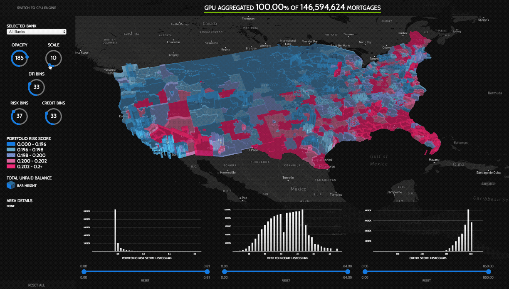

# RAPIDS Mortgage Visualization Demo




[RAPIDS](https://rapids.ai/) is an open source platform for data scientist to accelerate Big Data workflows with GPU optimized libraries. The home loan visualization uses the RAPIDS [cuDF](https://github.com/rapidsai/cudf) powered cuXfilter - pronounced "koo-cross-filter" - library to provide a real time, interactive interface to the data. RAPIDS libraries are designed to fit within data scientist's existing workflows and tool kits, as well as be easily extensible. This web based data visualization demo, produced from a RAPIDS accelerated end to end workflow illustrates one such example. 


## Description
The 'viz' demo illustrates the speed of the GPU powered RAPIDS cuDF library, extended through the cuXfilter library, to enable fast “Crossfilter” style multi-dimensional filtering. By performing calculations on the GPU, a data scientist can interact with large datasets directly and in 'real time,'' without having to wait, perform batch operations, or subsample the data. This improved UX helps data scientists switch from an environment where exploring big data is cumbersome and laggy, to one which encourages more experimental and iterative analysis.

The 'viz' demo has two modes: CPU and GPU, utilizing the same frontend to showcase the speed and interaction difference between the two backends. 


## Interaction
The visualization utilizes the speed of the RAPIDS cuDF library to run all group By, filtering, and histogram bin size calculations on the *backend GPU*, and only send the minimal amount of data to the front end web page to be rendered.

* Press and Hold Shift while clicking and dragging on the map will tilt its perspective.
* The center green status bar will indicate how much of the total dataset is being filtered, when a request is being processed, or turn orange if there is an error.
* Scrolling the histogram bin sizes dials will dynamically update the chart bin count.
* Scrolling the map scale dial exaggerates the map bar height for better differentiation.
* Scrolling the map opacity dial exaggerates the map bar colors for better differentiation.
* Selecting a bank will filter all data for that bank. Selecting 'all' will remove the filter.
* Clicking on a 3-zip boundary will filter all data for just that 3-zip. Clicking on it again will remove the filter.
* Hovering over a 3-zip boundary will show its “Area Details.”
* Clicking and dragging or panning across a range slider will filter all data to that highlighted data range (except for the selected histogram). Clicking reset will remove its filter.
* Clicking reset below a histogram will reset its filter.
* Clicking 'reset initialization' will reset and reload all the data (similar to reloading the page).
* Clicking 'switch to cpu/gpu' will switch between GPU and CPU modes.


## Data
The raw data comes from 2006-2017 [Fannie Mae public loan data](http://fanniemae.com/portal/funding-the-market/data/loan-performance-data.html) and the risk score is generated from a model trained on an end to end workflow using the RAPIDS framework. 

146 million active and non-delinquent loans are given a score from 0-1 to indicate the likelihood of the loan being risky for purchase as part of a loan portfolio. Riskiness could mean a chance of delinquency during the lifetime of the loan, or that the loan will be paid off soon and cease generating interest payments.

The data is visualized with the following features:
* 3-zip boundary: postal zip code with the last 2 digests removed for privacy (951XX)
* 3-zip boundary bar height: total unpaid balance of all loans in that 3-zip area
* 3-zip boundary color: mean risk score of all loans in the 3-zip area
* Risk scores distribution histogram (dynamic bin size)
* Debt to Income ratio ( gross monthly income to gross monthly debt ) distribution histogram of loan recipients (dynamic bin sizes)
* Credit score (FICO) distribution histogram of loan recipients  (dynamic bin sizes)
* Bank ( generally loan originator )


## Software Requirements
The demo has two parts, the *web demo frontend* and the *cuXfilter demo backend*. While the frontend can be served on most Linux, Ubuntu, or Windows machines and accessed from any modern web browser, the backend requires a Linux or Ubuntu system. Note: While the demo can technically server multiple users at once, because of memory limitations this will likely result in OOM - out of memory - errors. 

Note: the demo requires a *Mapbox Access Token*, [details here](https://www.mapbox.com/help/define-access-token/), to use the underlying geographic map layer. For limited usage they are free with a Mapbox account. Supply the token in the ```/config.json``` configuration file located in root repo directory. Without a token, only data will be rendered (e.g. no roads or city names).


## Hardware Requirements
The web demo frontend itself does not have extensive hardware requirements and can often be run from a laptop, but having a good graphics card improves the experience. The demo is responsive to both large wide screens and smaller single screens. It is *not* suitable for mobile. 

The demo backend has extensive hardware requirements including having one Nvidia card with at least *16GB of GPU memory*. To run the CPU option of the demo requires at least *64GB of system memory*. 


## Error Handling
If the frontend demo appears to hang or the status bar turns orange, check the web browser javascript console for error messages. Often pressing the 'reset initialization' button and/or refreshing the browser window will fix the issue. Sometimes a really really bad OOM error can occur on the backend. Check the cuXfilter readme for details on resetting the backend server.


## Featured Libraries
* [RAPIDS cuDF data frame](https://github.com/rapidsai/cudf)
* [Deck.gl geospatial visualization from Uber](https://deck.gl/)
* [Victory charts from Formidable Labs](https://formidable.com/open-source/victory/docs/)
* [React from Facebook](https://reactjs.org/)


## Installation
### RAPIDS Mortgage Visualization Demo Docker Install (recommended)
To install the fully encapsulated demo via docker, please refer to the cuXfilter readme. Note: Be sure to setup the ```/config.json``` file *before* running the docker command.

### RAPIDS Mortgage Visualization Frontend Only Source Install
To install and run the frontend demo from source, follow the typical node + webpack procure. Note: assumes that the backend has been already setup. 

Note: any update to cuXfilter-client.js requires the frontend be rebuilt as well.

Note: installing on a Windows machine may require some additional steps, such as making sure the Python environment is setup correctly.

Note: running the demo locally with a remote backend requires the local ```/config.json``` gtc_demo_port value to be set to port 3000, *not port 3005*.


Clone repo.
```git clone```

Install node modules.
```npm install```

Edit configuration file located in the repo's root to add backend IP address, dataset name, and mapbox token etc.
```/config.json```

Run hot update webpack development server.
```npm run dev```

Build via webpack. Note: /src/data folder is *not* automatically copied over to /public on build.
```npm run build```

Run express web server to host.
```npm run start``` 

