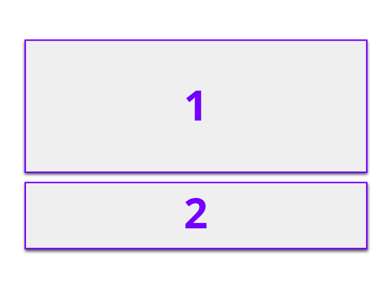
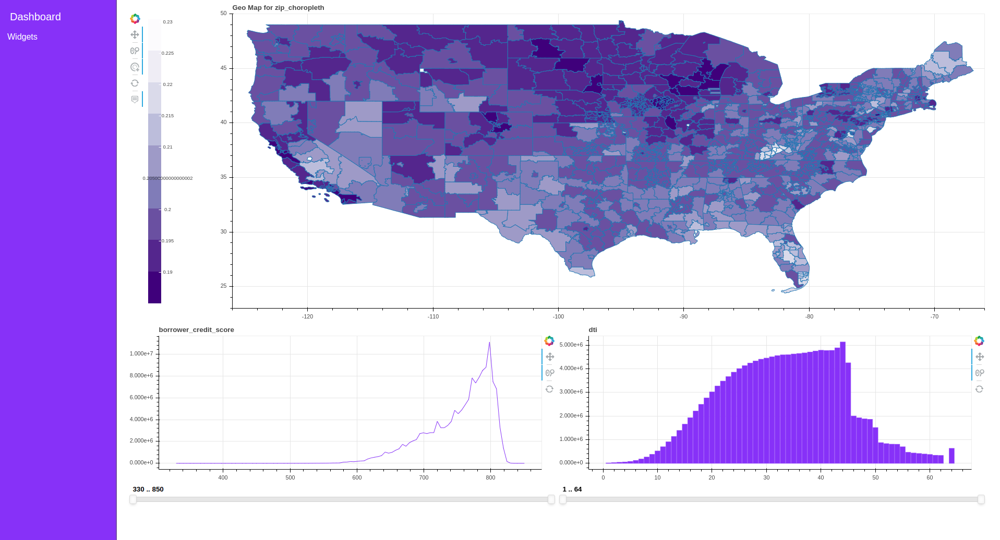
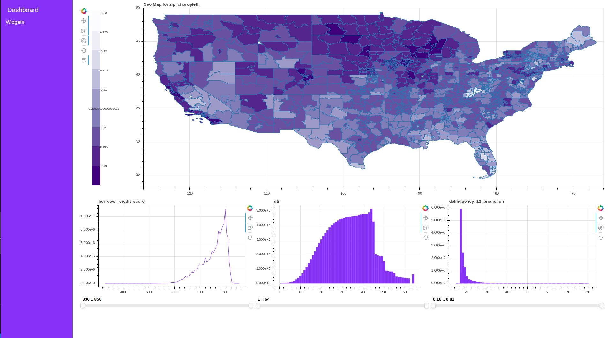

Layouts
=======

Load cuXfilter and data
-----------------------

.. code-block:: python

    from cuXfilter import charts
    import cuXfilter
    from bokeh import palettes
    cux_df = cuXfilter.DataFrame.from_arrow('/data/146M_predictions_v2.arrow')
    cux_df.data['loan_id'] = cux_df.data['loan_id'].astype('float64')
    cux_df.data['current_actual_upb'] = cux_df.data['current_actual_upb'].astype('float64')
    cux_df.data = cux_df.data.sort_values(by='loan_id')

Declare charts
--------------

.. code-block:: python

    chart0 = charts.bokeh.choropleth(x='zip', y='delinquency_12_prediction', aggregate_fn='mean', 
                                  geo_color_palette=palettes.Purples9,
                                  geoJSONSource = 'https://raw.githubusercontent.com/rapidsai/cuxfilter/master/demos/GTC%20demo/src/data/zip3-ms-rhs-lessprops.json',
                                  data_points=1000, x_range=(-126, -66), y_range=(23, 50),
                                  nan_color='white')
    chart1 = charts.bokeh.line('borrower_credit_score',step_size=1)
    chart2 = charts.bokeh.bar('dti')
    chart3 = charts.bokeh.bar('delinquency_12_prediction')
    chart4 = charts.bokeh.bar('seller_name',data_points=100)
    chart5 = charts.bokeh.line(x='loan_id',y='current_actual_upb')
    chart6 = charts.bokeh.line('dti')
    chart7 = charts.bokeh.line('delinquency_12_prediction')
    chart8 = charts.bokeh.bar('borrower_credit_score', data_points=100)

layout_0
--------

.. image:: ./layout_thumbnails/layout_0.png
    :width: 350px
    :align: center

.. code-block:: python

    from cuXfilter import layouts
    d = cux_df.dashboard([chart0], layout=layouts.layout_0, title="Dashboard")
    d.show()

.. image:: ./layout_samples/layout0.png

layout_1
--------

    
.. code-block:: python

    from cuXfilter import layouts
    d = cux_df.dashboard([chart0, chart1], layout=layouts.layout_1, title="Dashboard")
    d.show()

.. image:: ./layout_samples/layout1.png

layout_2
--------

.. image:: ./layout_thumbnails/layout_2.png
    :width: 350px
    :align: center

.. code-block:: python

    from cuXfilter import layouts
    d = cux_df.dashboard([chart0, chart1], layout=layouts.layout_2, title="Dashboard")
    d.show()

.. image:: ./layout_samples/layout2.png

layout_3
--------

.. image:: ./layout_thumbnails/layout_3.png
    :width: 350px
    :align: center

.. code-block:: python

    from cuXfilter import layouts
    d = cux_df.dashboard([chart0, chart1, chart2], layout=layouts.layout_3, title="Dashboard")
    d.show()

.. image:: ./layout_samples/layout3.png

layout_4
--------

.. image:: ./layout_thumbnails/layout_4.png
    :width: 350px
    :align: center
    
.. code-block:: python

    from cuXfilter import layouts
    d = cux_df.dashboard([chart0, chart1, chart2], layout=layouts.layout_4, title="Dashboard")
    d.show()

.. image:: ./layout_samples/layout4.png

layout_5
--------

.. image:: ./layout_thumbnails/layout_5.png
    :width: 350px
    :align: center
    
.. code-block:: python

    from cuXfilter import layouts
    d = cux_df.dashboard([chart0, chart1, chart2], layout=layouts.layout_5, title="Dashboard")
    d.show()

layout_6
--------

.. image:: ./layout_thumbnails/layout_6.png
    :width: 350px
    :align: center
    
.. code-block:: python

    from cuXfilter import layouts
    d = cux_df.dashboard([chart0, chart1, chart2, chart3], layout=layouts.layout_6, title="Dashboard")
    d.show()

.. image:: ./layout_samples/layout6.png

layout_7
--------

.. image:: ./layout_thumbnails/layout_7.png
    :width: 350px
    :align: center
    
.. code-block:: python

    from cuXfilter import layouts
    d = cux_df.dashboard([chart0, chart1, chart2, chart3], layout=layouts.layout_7, title="Dashboard")
    d.show()

layout_8
--------

.. image:: ./layout_thumbnails/layout_8.png
    :width: 350px
    :align: center
    
.. code-block:: python

    from cuXfilter import layouts
    d = cux_df.dashboard([chart0, chart1, chart2, chart3, chart4], layout=layouts.layout_8, title="Dashboard")
    d.show()

.. image:: ./layout_samples/layout8.png

layout_9
--------

.. image:: ./layout_thumbnails/layout_9.png
    :width: 350px
    :align: center
    
.. code-block:: python

    from cuXfilter import layouts
    d = cux_df.dashboard([chart0, chart1, chart2, chart3, chart4, chart5], layout=layouts.layout_9, title="Dashboard")
    d.show()

.. image:: ./layout_samples/layout9.png

layout_10
---------

.. image:: ./layout_thumbnails/layout_10.png
    :width: 350px
    :align: center
    
.. code-block:: python

    from cuXfilter import layouts
    d = cux_df.dashboard([chart0, chart1, chart2, chart3, chart4, chart5], layout=layouts.layout_10, title="Dashboard")
    d.show()

.. image:: ./layout_samples/layout10.png

layout_11
---------

.. image:: ./layout_thumbnails/layout_11.png
    :width: 350px
    :align: center
    
.. code-block:: python

    from cuXfilter import layouts
    d = cux_df.dashboard([chart0, chart1, chart2, chart3, chart4, chart5], layout=layouts.layout_11, title="Dashboard")
    d.show()

.. image:: ./layout_samples/layout11.png

layout_12
---------

.. image:: ./layout_thumbnails/layout_12.png
    :width: 350px
    :align: center
    
.. code-block:: python

    from cuXfilter import layouts
    d = cux_df.dashboard([chart0, chart1, chart2, chart3, chart4, chart5, chart6, chart7, chart8], layout=layouts.layout_12, title="Dashboard")
    d.show()

.. image:: ./layout_samples/layout12.png