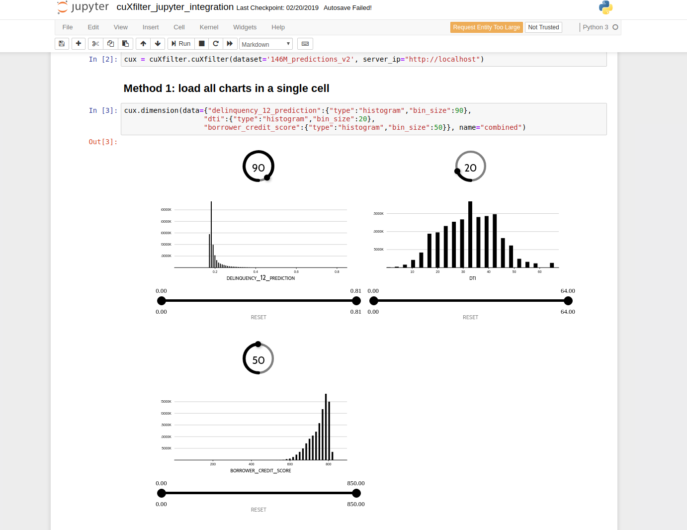

# RAPIDS Jupyter Notebook Integration demo

## Description

The jupyter notebook integration demo illustrates one way to use the power of cuxfilter. This allows us to perform crossfiltering inside a notebook while the aggregations happen on a cudf stored on a server-side gpu!

If you are already running the cuxfilter docker container, just visit `http://server.ip.addr/jupyter` to execute the demo.
