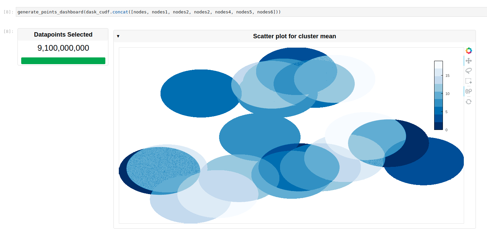

# 
&nbsp; cuxfilter with multi-GPU using dask_cudf

[Dask-cuDF](https://github.com/rapidsai/cudf/tree/main/python/dask_cudf) extends Dask where necessary to allow its DataFrame partitions to be processed by cuDF GPU DataFrames as opposed to Pandas DataFrames. For instance, when you call dask_cudf.read_csv(…), your cluster’s GPUs do the work of parsing the CSV file(s) with underlying cudf.read_csv().

## When to use cuDF and Dask-cuDF

If your workflow is fast enough on a single GPU or your data comfortably fits in memory on a single GPU, you would want to use cuDF. If you want to distribute your workflow across multiple GPUs, have more data than you can fit in memory on a single GPU, or want to analyze data spread across many files at once, you would want to use Dask-cuDF.

A very useful guide to using Dask-cudf can be found [here](https://docs.rapids.ai/api/cudf/stable/user_guide/10min.html)

## Cuxfilter with Dask-cudf

Using cuxfilter with Dask-cudf is a very seamless experience, and passing in a `dask_cudf.DataFrame` object, instead of `cudf.DataFrame` object should just work, without any other modifications. The `dask_cudf.DataFrame` should however be initialized with it's partitions set, before passing it the the `cuxfilter.DataFrame.from_dataframe` function.

## Use cases

### Massive scale interactive scatter-plot rendering

Single GPU performance on a `Nvidia Quadro GV100(32GB)`:

| 3 * Float32 Columns |      |        |      |                           |
|------------------------------------|------|--------|------|---------------------------|
| Points                             | 1M   | 50M    | 100M | 500M                      |
| Dashboard generation Time         | 0.07-0.1 seconds            | 0.07-0.1 seconds             | 0.1-0.2 seconds            | 2-3 seconds             |
| Memory                             | ~1GB | ~3.5GB | ~7GB | ~ 20GB (spikes upto 28GB) |
| Performance                       | <0.3s interaction time  | <0.3s interaction time   | <0.3s interaction time   | <0.5s interaction time    |

Multi-GPU performance on a DGX machine with `8 * Nvidia Quadro GV100(32GB)`:

| 3 * Float32 Columns |                           |                            |                            |                             |                             |
|-----------------------------------|---------------------------|----------------------------|----------------------------|-----------------------------|-----------------------------|
| Points                            | 1B                        | 2B                         | 5B                         | 9B                          | 12B                         |
| Dashboard generation Time         | 60-120 seconds            | 60-120 Seconds             | 120-180 seconds            | 120-180 seconds             | 300-360seconds              |
| Memory                            | ~40GB (spikes up to 60GB) | ~ 50GB (spikes up to 85GB) | ~66GB (spikes up to 115GB) | ~ 76GB (spikes up to 144GB) | ~ 80GB (spikes up to 165GB) |
| Performance                       | ~10-15s interaction time  | ~10-15s interaction time   | ~15-35s interaction time   | ~15-35s interaction time    | ~30-60s interaction time    |

### Example

Fig: Interactive dashboard with 9.1B points rendered

## Currently Supported Charts

| Library  | Chart type |
| ------------- | ------------- |
| bokeh  | bar, line  |
| datashader  | scatter, scatter_geo, line, stacked_lines, heatmap, graph(note: edge rendering support is limited for now) |
| panel_widgets  | range_slider, date_range_slider, float_slider, int_slider, drop_down, multi_select, card, number  |
| custom    | view_dataframe |
| pydeck    | choropleth(3d and 2d)   |
